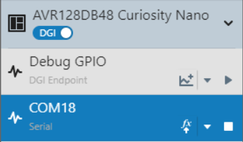
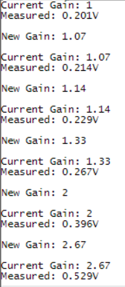

<!-- Please do not change this logo with link -->

# Signal Scaling with the OPAMP on the AVR® DB Family of MCUs

This demo application shows how to use one of the Operational Amplifiers (OPAMP) in the AVR® DB family of microcontrollers (MCUs) to create a Programmable Gain Amplifier (PGA) for the on-board Analog-to-Digital Converter (ADC). The ADC is triggered automatically by the Real-Time Counter (RTC) via the Event System (EVSYS) to reduce device power consumption.

## Related Documentation

- [AVR128DB48 Documentation](https://www.microchip.com/en-us/product/AVR128DB28?utm_source=GitHub&utm_medium=TextLink&utm_campaign=MCU8_MMTCha_avrdb&utm_content=avr128db48-analog-demo-mplab-mcc)

## Software Used

- [MPLAB® X IDE v6.05 or newer](https://www.microchip.com/en-us/tools-resources/develop/mplab-x-ide?utm_source=GitHub&utm_medium=TextLink&utm_campaign=MCU8_MMTCha_avrdb&utm_content=avr128db48-analog-demo-mplab-mcc)
- [MPLAB XC8 v2.40 or newer](https://www.microchip.com/en-us/tools-resources/develop/mplab-xc-compilers?utm_source=GitHub&utm_medium=TextLink&utm_campaign=MCU8_MMTCha_avrdb&utm_content=avr128db48-analog-demo-mplab-mcc)
- [MPLAB Code Configurator (MCC) Plugin](https://www.microchip.com/en-us/tools-resources/configure/mplab-code-configurator?utm_source=GitHub&utm_medium=TextLink&utm_campaign=MCU8_MMTCha_avrdb&utm_content=avr128db48-analog-demo-mplab-mcc)
- [AVR-Dx_DFP v2.3.272 or newer](https://packs.download.microchip.com/)
- MPLAB Data Visualizer Plugin or serial terminal

## Hardware Used

- [AVR128DB48 Curiosity Nano Evaluation Kit (EV35L43A)](https://www.microchip.com/en-us/development-tool/EV35L43A?utm_source=GitHub&utm_medium=TextLink&utm_campaign=MCU8_MMTCha_avrdb&utm_content=avr128db48-analog-demo-mplab-mcc)
  - Running at 3.3V (default)
- Variable Power Supply or Other Signal Source
- Breadboard and Wire (for connecting)

## I/O Setup

| I/O Pin | Name
| ------  | ----
| RB0 | USART TX
| RB1 | USART RX (unused)
| RB2 | Switch 0 (SW0)
| RD1 | OPAMP 0 Input (+)
| RD2 | OPAMP 0 Output

## Peripheral Configuration

**UART** - 9600 baud, 8 data bits, no parity, 1 stop bit  
**ADC** - Single sample, triggered on event (Channel 0), VREF = VDD  
**RTC** -  1 kHz internal oscillator   
**EVSYS** - Channel 0 event generator: RTC/1024  
**CCL** - Connected to SW0, run standby, D-input flip-flop synchronized to 1 kHz internal oscillator, filter enabled

## Setting MPLAB Data Visualizer

The first step is to open the MPLAB Data Visualizer tool by pressing the "DV" icon in the toolbar as shown below.

*Note: If this icon is not shown, please install MPLAB Data Visualizer in the Tools &rarr; Plugins window before continuing.*

Then select the COM port associated with the Curiosity Nano by clicking the COM port entry. Set any settings required in the box below (defaults are OK for this example).

When the correct COM port has been selected and the Data Visualizer settings are set, press the Play button to open the COM port.

After opening the COM port, the last step is to set the terminal window to use the COM port as a data source.

## Operation

This demo implements an analog signal chain with one of the OPAMPs acting as a PGA for the ADC. The PGA can switch gains without using external components due to the internal resistor ladder on the device. There are eight steps on the ladder plus a Unity Gain mode for a total of nine possible gains (1x, 1.07x, 1.14x, 1.33x, 2x, 2.67x, 4x, 8x, 16x) with a single OPAMP.

The output signal from the OPAMP is measured by the ADC about once per second. The ADC is triggered to start a measurement from a divided-down RTC clock signal connected to the EVSYS. When the measurement is complete, an interrupt is created by the ADC to wake the MCU from Standby Sleep mode.

LED0 on the Curiosity Nano toggles when the MCU is ready to print a result. The current gain of the OPAMP and the actual measured value are printed to the Universal Asynchronous Receiver Transmitter (UART) terminal at 9600 baud (see example image below). Once the UART is idle, then the microcontroller enters Standby Sleep mode to save power.

To switch the OPAMP gain configuration, press button SW0 on the Curiosity Nano. The output signal from SW0 is debounced by the Configurable Custom Logic (CCL). The rising edge interrupt from the CCL's output wakes the microcontroller to perform the following process:

- Stop the RTC
- Modify the gain (and configuration) of the OPAMP
- Wait for the OPAMP output to settle
- Print the new OPAMP gain to the terminal
- Restart the RTC
- Return to Standby Sleep

Each time the button is pressed, the gain is increased by one step. If the gain is at max, then the gain is switched to 1x and the pattern repeats.

## Summary
This demo has shown how to use the OPAMP and ADC on the AVR DB family of MCUs to implement a PGA for signal measurements.
