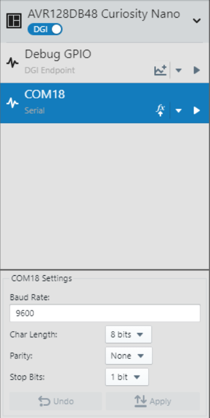
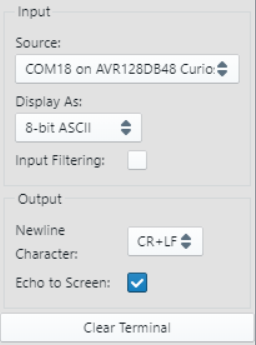

<!-- Please do not change this logo with link -->

# Signal Scaling with the OPAMP on the AVR® DB Family of MCUs

This demo application shows how to use one of the Operational Amplifiers (OPAMP) in the AVR® DB family of MCUs to create a Programmable Gain Amplifier for the on-board Analog-to-Digital Converter (ADC). The ADC is triggered automatically by the Real-Time Counter (RTC) via the Event System (EVSYS) to reduce device power consumption.

## Related Documentation

- [AVR128DB48 Documentation](https://www.microchip.com/wwwproducts/en/AVR128DB28?utm_source=GitHub&utm_medium=TextLink&utm_campaign=MCU8_MMTCha_avrdb&utm_content=avr128db48-analog-demo-mplab-mcc)

## Software Used

- [MPLAB® X IDE v5.50 or newer](https://www.microchip.com/en-us/development-tools-tools-and-software/mplab-x-ide?utm_source=GitHub&utm_medium=TextLink&utm_campaign=MCU8_MMTCha_avrdb&utm_content=avr128db48-analog-demo-mplab-mcc)
- [MPLAB XC8 v2.31 or newer](https://www.microchip.com/en-us/development-tools-tools-and-software/mplab-xc-compilers?utm_source=GitHub&utm_medium=TextLink&utm_campaign=MCU8_MMTCha_avrdb&utm_content=avr128db48-analog-demo-mplab-mcc)
- [MPLAB Code Configurator (MCC) v4.2.3](https://www.microchip.com/en-us/development-tools-tools-and-software/embedded-software-center/mplab-code-configurator?utm_source=GitHub&utm_medium=TextLink&utm_campaign=MCU8_MMTCha_avrdb&utm_content=avr128db48-analog-demo-mplab-mcc)
  - [Melody Library v1.84.5](https://www.microchip.com/en-us/development-tools-tools-and-software/embedded-software-center/mplab-code-configurator?utm_source=GitHub&utm_medium=TextLink&utm_campaign=MCU8_MMTCha_avrdb&utm_content=avr128db48-analog-demo-mplab-mcc)
- [AVR-Dx_DFP v1.1.119 or newer](https://packs.download.microchip.com/)
- [MPLAB Data Visualizer Plugin](https://www.microchip.com/en-us/development-tools-tools-and-software/embedded-software-center/mplab-data-visualizer?utm_source=GitHub&utm_medium=TextLink&utm_campaign=MCU8_MMTCha_avrdb&utm_content=avr128db48-analog-demo-mplab-mcc) or serial terminal

## Hardware Used

- [AVR128DB48 Curiosity Nano Evaluation Kit (EV35L43A)](https://www.microchip.com/DevelopmentTools/ProductDetails/PartNO/EV35L43A?utm_source=GitHub&utm_medium=TextLink&utm_campaign=MCU8_MMTCha_avrdb&utm_content=avr128db48-analog-demo-mplab-mcc)
  - Running at 3.3V (default)
- Variable Power Supply or Other Signal Source
- Breadboard and Wire (for connecting)

## Enabling Floating Point Printf Support

To enable floating point Printf support on AVR devices, add the following settings to the XC8 linker options:

`-Wl,-u,vfprintf -lprintf_flt -lm`

## I/O Setup

| I/O Pin | Name
| ------  | ----
| RB0 | USART TX
| RB1 | USART RX (unused)
| RB2 | Switch 0 (SW0)
| RD1 | OPAMP 0 Input (+)
| RD2 | OPAMP 0 Output

## Peripheral Configuration

**UART** - 9600 Baud, 8-bits, No Parity, 1 Stop Bit  
**ADC** - Single Sample, Triggered on Event (Channel 0), VREF = VDD  
**RTC** -  1kHz Internal Oscillator   
**EVSYS** - Channel 0 Event Generator: RTC / 1024  
**CCL** - Connected to SW0, Run Standby, D-input Flip-Flop Synchronized to 1 kHz internal oscillator, Filter Enabled

## Setting MPLAB Data Visualizer

The first step is to open the MPLAB Data Visualizer tool by pressing the "DV" icon in the toolbar as shown below.

*If this icon is not shown, please install MPLAB Data Visualizer in the Tools &rarr; Plugins window before continuing.*

Then select the COM port associated with the Curiosity Nano  by clicking on COM port entry. Set any settings required in the box below (defaults are OK for this example).

When the correct COM port has been selected and the Data Visualizer settings are set, press the play button to open the COM port.

Once the COM port has been opened, the last step is to set the terminal window to use the COM port as a data source.

## Regenerating the API

**Caution! If regenerating the MCC API, please be careful when merging changes to avoid overwriting the modified ISR handlers. This will break functionality.**

When code can't be merged, MCC asks the user to approve changes by pressing the arrow or X next to the relevant change. Closing the merge window will decline any unapproved changes.

## Operation

This demo implements an analog signal chain with 1 of the OPAMPs acting as a Programmable Gain Amplifier (PGA) for the ADC. The PGA  can switch gains without using external components due to the internal resistor ladder on the device. There are 8 steps on the ladder plus a unity gain mode for a total of 9 possible gains (1x, 1.07x, 1.14x, 1.33x, 2x, 2.67x, 4x, 8x, 16x) with a single OPAMP.

The output signal from the OPAMP is measured by the ADC about once per second. The ADC is triggered to start a measurement from a divided down RTC clock signal connected to the Event System. When the measurement is complete, an interrupt is created by the ADC to wake the MCU from Standby Sleep.

LED0 on the Curiosity Nano toggles when the MCU is ready to print a result. The current gain of the OPAMP and the actual measured value are printed to the UART terminal at 9600 baud (see example image below). Once the UART is idle, then the microcontroller enters standby sleep to save power.

To switch the OPAMP gain configuration, press button SW0 on the Curiosity Nano. The output signal from SW0 is debounced by a CCL. The rising edge interrupt from the CCL's output wakes the microcontroller to switch gains. Then, the MCU wakes up and performs the following operations:

- Stop the RTC
- Modify the gain (and configuration) of the OPAMP
- Wait for the OPAMP output to settle
- Print the new OPAMP gain to the terminal
- Restart the RTC
- Return to Standby Sleep

Each time the button is pressed, the gain is increased by one step. If the gain is at max, then the gain is switched to 1x and the pattern repeats.

## Summary
This demo has shown how to use the OPAMP and ADC on the AVR DB family of MCUs to implement a PGA for signal measurements.
